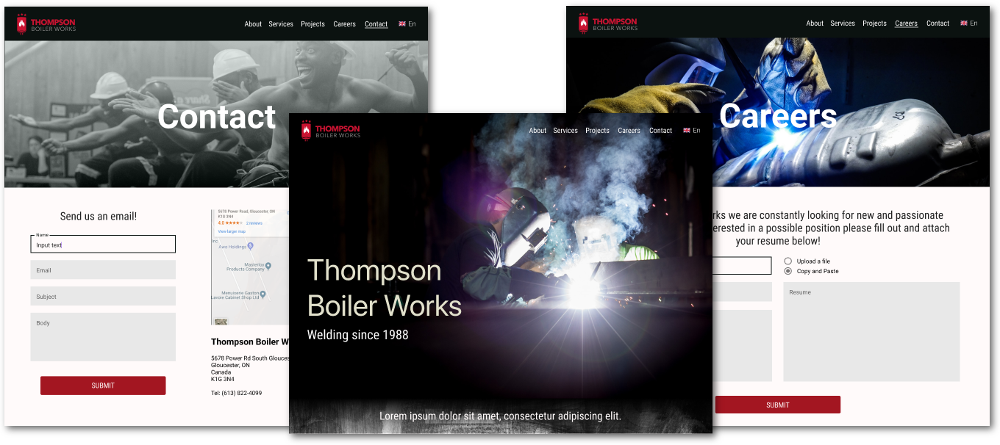

# Thompson Boiler Works


## Table of Contents
- [About the Repo](#about-the-repo)
- [Getting Started](#getting-started)
- [Code Structure](#code-structure)
- [Tech](#tech)
- [Deployment](#deployment)
- [Contributors](#contributors)
- [License](#license)


## About the Repo
This repo shows the development state of the website built at [ThompsonBoilerWorks.ca](https://ThompsonBoilerWorks.ca).

Despite being available on github, this repo is intended as a read-only resource and has been licensed as such. Permissions are not given to use or modify this software.

## Getting Started
*This section is intended for usage of future developers or upon permissional changes.*

After cloning the repo to your local machine enter the `frontend` directory and run `npm install`.

Having completed this, in the root directory run `docker-compose up`.

This runs the app in the development mode.<br>
Open [http://localhost:3000](http://localhost:3000) to view it in the browser.

The page will reload if you make edits.<br>
You will also see any lint errors in the console.

## Code Structure
Explained here are the most important points of the code structure, where to find configs, etc.
```
.
├── backend
│   ├── .gitignore          # Files that should not be posted to git (ex. npm modules)
│   ├── Dockerfile          # Backend container configs
│   ├── package.json        # Backend code dependencies
│   ├── index.js           # Main app file starting and handling node server.
│   └── ...
├── frontend                
│   ├── public              # Static assets that are deployed as-is when built
│   ├── src                 # Code directory for frontend container
│   │   ├── Assets          # Static assets (images, icons)
│   │   ├── Components      # Non-page level react components (ex. navbar)
│   │   ├── Pages           # React component pages (ex. about, contact)
│   │   ├── Styles          # Global styles and SCSS mixins
│   │   ├── Utils           # Reusable functions and globals\
│   │   ├── Values          # Localization data (language translations)
│   │   ├── App.jsx         # Main app file composing the entire application
│   │   └── ...
│   ├── .gitignore          # Files that should not be posted to git (ex. npm modules)
│   ├── jsconfig.json       # Project config (enables absolute path imports)
│   ├── Dockerfile          # Frontend container configs
│   ├── package.json        # Frontend code dependencies
│   └── ...
├── .eslintrc               # Airbnb Eslint configs/rules
├── .prettierrc             # Prettier configs/rules
├── docker-compose.yaml     # Container runner and configurations
└── ...
```

## Tech
Frontend: 
- [React](https://reactjs.org/)
- [Material-ui](https://material-ui.com/)
- [SCSS](https://sass-lang.com/)
- [i18next](https://www.i18next.com/)
- [Yup](https://github.com/jquense/yup)

Backend:
- [Node](https://nodejs.org/en/)
- [Express](https://expressjs.com/)
- [Google APIs](https://www.npmjs.com/package/googleapis)

DevOps:
- [Docker-compose](https://docs.docker.com/compose/)

Linting and Formatting: 
- [Airbnb style guide](https://airbnb.io/javascript/react/)
- [Eslint](https://eslint.org/)
- [Prettier](https://prettier.io/)


## Deployment
This website is currently deployed onto Amazon Web Services by making use of the free plans 750 hours of free EC2 usage.

//more to come

## Contributors
- Eros Di Pede
  + [Github](https://github.com/ForkBombGIT)
  + [Website](https://erosdipede.me/)
- Josh Gorman
  + [Github](https://github.com/Liannus)
  + [Website](https://joshgorman.ca/)
  
## License
As this code is currently unlicensed, no permissions are given to use or modify this software.
